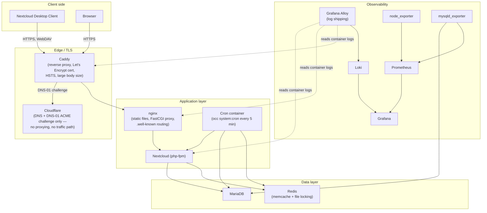

# Nextcloud + MariaDB Deployment — Technical Documentation

## Overview

Self-hosted Nextcloud instance with MariaDB, deployed via Docker Compose
and Ansible, running on a local machine (M1 MacBook Pro / Docker Desktop).
Fronted by Caddy for TLS termination using a real, publicly-trusted
Let's Encrypt certificate obtained via DNS-01 (Cloudflare), on a real,
purchased domain. Includes monitoring (Prometheus + Grafana) and log
aggregation (Loki + Grafana Alloy).

## Architecture



## Component table

| Component | Image | Role |
|---|---|---|
| Caddy | custom build (`caddy:2-alpine` + `caddy-dns/cloudflare` plugin) | TLS termination, automatic Let's Encrypt via DNS-01, HSTS, reverse proxy |
| nginx | `nginx:alpine` | Serves static files, proxies PHP requests to `app`, handles `.well-known` routing, MIME types |
| Nextcloud (app) | `nextcloud:fpm` | Application server (PHP-FPM) |
| Nextcloud (cron) | `nextcloud:fpm` (same image, different entrypoint) | Dedicated background job runner (`/cron.sh`, `occ system:cron` every 5 min) |
| MariaDB | `mariadb:11` | Primary database |
| Redis | `redis:7-alpine` | Memcache (local + distributed) and file locking |
| Prometheus | `prom/prometheus` | Metrics collection (scrapes exporters every 15s) |
| Grafana | `grafana/grafana` | Metrics + log visualization (dashboards, Explore) |
| node_exporter | `prom/node-exporter` | Host-level metrics (CPU, memory, disk) |
| mysqld_exporter | `prom/mysqld-exporter` | MariaDB metrics (connections, query throughput, InnoDB stats) |
| Loki | `grafana/loki` | Log storage and query engine |
| Grafana Alloy | `grafana/alloy` | Log collection agent (discovers Docker containers, ships logs to Loki) — replaces the now-EOL Promtail |

## Design decisions and tradeoffs

**Nextcloud fpm + nginx, not the Apache image.** Chosen for explicit
control over upload body-size limits, timeouts, and `.well-known`
routing — settings this task specifically grades on. Closer to how
a production deployment would separate concerns between web server
and application runtime.

**Caddy over nginx/Traefik for TLS.** Caddy's automatic HTTPS and
built-in ACME (including DNS-01 via the Cloudflare plugin) require
substantially less configuration than assembling the equivalent with
certbot + nginx, or configuring Traefik's dynamic provider model —
which offers no benefit here given a small, fixed set of services.

**DNS-01 via Cloudflare, not HTTP-01.** The host (a laptop) has no
guaranteed stable public IP or inbound port access. DNS-01 requires
zero inbound connectivity — only outbound access to Cloudflare's API
to create a TXT record — making it the only viable path to a real,
publicly-trusted certificate from a machine that isn't a conventional
always-on server.

**No public reachability by design.** The domain's DNS record points
at loopback (`127.0.0.1`). This was a deliberate scope decision: the
task requires a real trusted certificate and a working desktop client,
neither of which requires public internet exposure. Exposing a laptop
to the public internet introduces real risk (attack surface, needing
to manage firewall/port-forwarding on networks not under the
deployer's control) for no requirement that actually demands it.

**Config overrides via a separate, upgrade-safe file.**
`nextcloud-overrides.config.php` is mounted into `config/` and copied
in via Ansible (not committed as a live bind-mount — see below).
Nextcloud auto-loads any `*.config.php` file in `config/`, and this
mechanism is explicitly designed to survive both application upgrades
and infrastructure rebuilds, since it lives outside both the app's own
managed config and the ephemeral data volume.

**Copy-in instead of a live bind-mount for the override file.**
An early version bind-mounted the override file directly into the
container. This broke on a genuinely fresh (empty) named volume —
a documented Docker/Docker Desktop limitation where creating a
single-file mountpoint inside a not-yet-populated volume can fail.
Fixed by copying the file in via `docker compose cp` as a post-install
Ansible step, run after confirming Nextcloud's install has completed.
Tradeoff: the file is a one-time snapshot, not live — changing it
requires a re-deploy (or re-running the copy task) to take effect,
which is a known and documented operational quirk.

**MariaDB containerized, not on bare metal.** Originally considered a
hybrid (MariaDB on a VM, Nextcloud in containers) to more closely
mirror a "real" infrastructure split. Descoped given the project
timeline — the containerized approach is fully valid, widely used in
production, and the hybrid approach would have added VM networking
and provisioning complexity without demonstrating anything the
current setup doesn't already show.

**Prometheus + Grafana over an all-in-one tool (e.g. Zabbix).**
Deliberately more moving parts than a single integrated monitoring
tool, in exchange for each piece being independently replaceable —
Grafana can visualize other data sources without touching Prometheus;
Prometheus's scrape targets are reusable regardless of the
visualization layer. Also the more common pattern in modern
containerized infrastructure.

**Grafana Alloy over Promtail for log shipping.** Promtail reached
end-of-life on March 2, 2026 (no further security patches or bug
fixes). Alloy is Grafana's official, actively maintained replacement.
Caught and corrected before finalizing, rather than shipping an
already-unsupported component.

## Deploy from zero

```bash
git clone <repo-url>
cd nextcloud
cp compose/.env.example compose/.env
# edit compose/.env with real values: passwords, domain, Cloudflare API token
cp compose/mysqld_exporter.cnf.example compose/mysqld_exporter.cnf
# edit compose/mysqld_exporter.cnf with the same exporter password used in .env
make deploy
```

`make deploy` runs the full Ansible playbook: verifies Docker is
installed and running, validates `.env` is present, pulls images,
brings up the stack, waits for Nextcloud's first-run install to
genuinely complete (not just for the container to respond), copies
in the config override file, creates the MariaDB monitoring user,
sets background jobs to cron mode, and runs mimetype/maintenance
repairs.

`make destroy` tears down all containers and volumes.
`make redeploy` chains both — full destroy and rebuild in one command.

This was tested for real: multiple full destroy/rebuild cycles were
run during development specifically to verify the "redeployable from
scratch" requirement, not merely to assert it. Two real bugs were
found and fixed this way — an install-completion race condition in
the Ansible readiness check, and the config-file bind-mount issue
described above — both of which were invisible during manual,
incremental testing against an already-running instance.

## Administration Overview — warnings addressed

See `docs/overview-warnings-log.md` for the full, detailed log of
every warning encountered, its cause, and its resolution. Summary:

**Resolved (10):** JavaScript module MIME type, WebDAV endpoint
self-connection, forwarded-for headers, OCS provider resolving,
`.well-known/webfinger`, font file loading, HTTP headers check,
mimetype migrations, maintenance window, default phone region,
server ID, cron/background jobs mode.

**Intentionally not resolved (3), with reasoning:**

- **AppAPI deploy daemon** — supports installing external "Ex-Apps";
  not required by any project deliverable.
- **Second factor enforcement** — 2FA is available but not enforced;
  a policy decision rather than a technical gap, left off to avoid
  adding login friction during development and demonstration.
- **Email/SMTP configuration** — requires real mail credentials not
  practical to provision for a local demo instance; would be a
  required piece (password resets, notifications) in production via
  a proper transactional email provider.

## What's still needed for production

- **No high availability.** Single host, no redundancy anywhere in
  the chain (app, database, proxy). A production deployment would
  need multiple app instances behind a load balancer and database
  replication with failover.
- **No public ingress.** This deployment is intentionally local-only.
  A production equivalent needs a stable public IP or a proper
  load balancer/ingress, not a laptop on loopback.
- **Secrets in a plain `.env` file, not a vault.** Acceptable for a
  local demo; production should pull secrets from a dedicated system
  (Vault, cloud provider secrets manager) at deploy time, never
  committed or left in a plaintext file on disk.
- **No tested backup/restore process.** Database dumps and the data
  directory would need a real, periodically-tested backup strategy,
  ideally stored offsite.
- **No SSO/centralized user provisioning.** Only a single admin
  account exists; production would integrate LDAP/SSO for real user
  management.
- **No WAF, rate limiting beyond Nextcloud's built-in
  brute-force protection, or fail2ban-style protections** at the
  infrastructure level.
- **No antivirus scanning (e.g. ClamAV) or office document
  collaboration (Collabora/OnlyOffice)** integrated.
- **No staging environment or formal patch/upgrade path** — upgrades
  would be tested directly against this single instance.
- **Log aggregation is intentionally scoped down.** Loki + Alloy is
  genuine, working log aggregation, but lighter than a full
  production pipeline (e.g. long-term retention policies, alerting
  rules, structured parsing beyond what's used here).
- **Certificate renewal is automatic (Caddy handles this natively)
  but relies on outbound access to Cloudflare's API** — worth noting
  explicitly as a dependency, however normal that dependency is.
- **GitHub Actions / CI pipeline not implemented.** Considered
  (either as basic lint/validation checks, or a fuller self-hosted
  runner deployment pipeline) but descoped given the project
  timeline. The repository structure (Ansible + Compose) would
  support adding this without restructuring anything.

## Repository structure

```
nextcloud/
├── ansible/
│   ├── inventory.ini
│   ├── site.yml
│   └── roles/nextcloud_deploy/tasks/
│       ├── main.yml
│       └── exporter_user.yml
├── compose/
│   ├── docker-compose.yml
│   ├── Caddyfile
│   ├── Dockerfile.caddy
│   ├── nginx.conf
│   ├── nextcloud-overrides.config.php
│   ├── prometheus.yml
│   ├── alloy-config.alloy
│   ├── .env.example
│   └── mysqld_exporter.cnf.example
├── docs/
│   └── overview-warnings-log.md
├── Makefile
└── .gitignore
```
